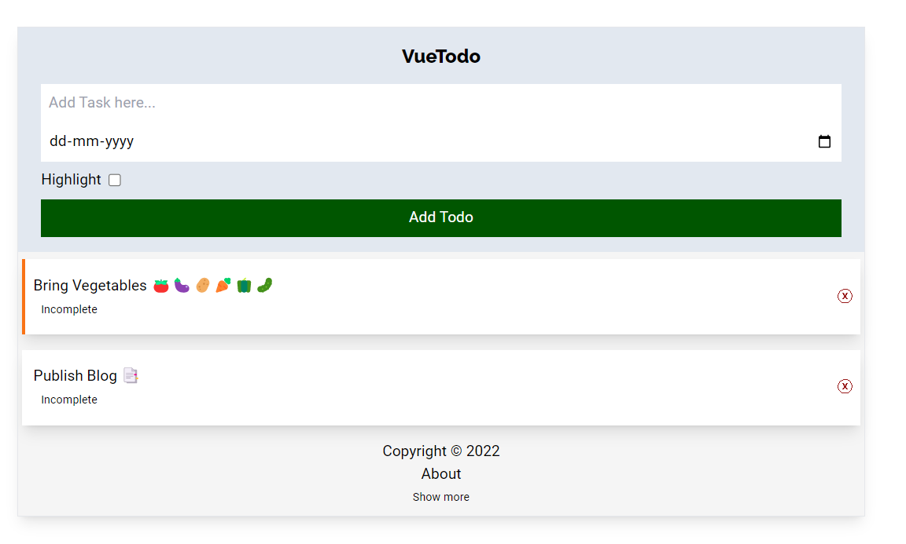

# Vue 3 TodoList App with TailwindCSS




Vue , Vitejs , TailwindCSS, JSON-server
Hosted on Vercel and Backend on Glitch

## Setup Project Locally

1. Install and Setup 

    ```js
        git clone 'https://github.com/singhkunal2050/vue-todo.git'
        npm install
        npm run backend
        npm run dev

    ```

2. Change Backend API URL to Local `https://dummy-json-server.glitch.me/todos` to `http://localhost:5000/todos` in src/components/Todo.vue


## Info

- Client URL
    https://vue-todos-demo.vercel.app/

- JSON Server
    https://dummy-json-server.glitch.me/todos
    Accepts : GET,POST,UPDATE,PUT,DELETE

- Backend Code
    https://glitch.com/edit/#!/dummy-json-server


## Todos

- Work on unique ID for each user with json-server instead of common db 